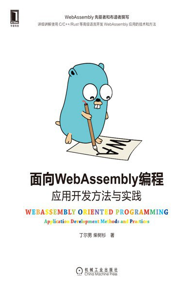

# C/C++面向WebAssembly编程

- [中文：C/C++面向WebAssembly编程](zh/README.md)
- 作者：丁尔男，Github [@3dgen](https://github.com/3dgen)
- 作者：柴树杉，Github [@chai2010](https://github.com/chai2010)，Twitter [@chaishushan](https://twitter.com/chaishushan)
- 项目地址：https://github.com/3dgen/cppwasm-book

---

# 《面向WebAssembly编程》已出版

- 京东：https://item.jd.com/13045744.html
- 当当：http://product.dangdang.com/29168336.html
- 豆瓣：https://book.douban.com/subject/35284009/

----

# WebAssembly friendly programming with C/C++

- [English: WebAssembly friendly programming with C/C++](en/README.md)
- Author: Ending，Github [@3dgen](https://github.com/3dgen)
- Author: ChaiShushan，Github [@chai2010](https://github.com/chai2010)，Twitter [@chaishushan](https://twitter.com/chaishushan)
- Translator: Ending，Github [@3dgen](https://github.com/3dgen)
- Translator: yushih, Github [@yushih](https://github.com/yushih)
- Repo: https://github.com/3dgen/cppwasm-book
